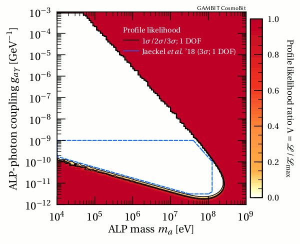

# Calculation of the expected fluence from axion-photon decays after SN1987A

Code to calculate the expected fluence from axion-photon decays after SN1987A by Marie Lecroq, Sebastian Hoof, and Csaba Balazs. Based on [[arXiv:1702.02964]](https://arxiv.org/abs/1702.02964) and published as a part of the **GAMBIT CosmoBit** paper.

## Results

## The code

## References
