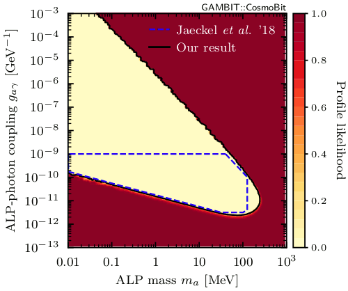

# The expected photon fluence from ALP decays after SN 1987A

***N.B.** Further development of this repository has been discontinued after the publication of ref. [[1]](#cosmoalp). Please visit the [`SNax` repository](https://github.com/sebhoof/snax) for a follow-up project.*

## Summary

Code authors: Marie Lecroq, Sebastian Hoof, and Csaba Bal&aacute;zs.

This repo contains code for calculating the expected fluence from decays of axion-like particles into photons after SN 1987A, based on the Monte Carlo simulations described in ref. [[2]](#res2).

Axion-like particles (ALPs) are produced in supernovae and subsequently decay into two photons or convert into photons inside magnetic fields on their way towards Earth. The non-observation [[3]](#data) of a such photons from the direction of SN 1987A can be used to place limits on the ALP-photon coupling [[4]](#res1). We focus on ALPs with masses of keV to GeV and reproduce and extend the work presented in ref. [[2]](#res2).

Please cite ref. [[1]](#cosmoalp) when using this code.

## Results

  

The figure above shows the 3 &sigma; limit obtained from using our Monte Carlo routines (black line). The blue dashed line shows the limits obtained by ref. [[2]](#res2) for comparison; they only considered ALP masses up to 100 MeV and ALP-photon couplings up to 10-9 GeV-1. Our fluxes tend to be higher than in ref. [[2]](#res2) by a factor of about 1.8 in agreement with ref. [[5]](#update). The figure can be produced with the [`plot_likelihood.py`](results/plot_likelihood.py) script.

## The code

The code implements a full Monte Carlo simulation without any rescaling factors. Details about the theoretical computations and the code can be found in [the documentation](documentation.pdf). The Python code was developed with Python version 3.5.7 and only rely on standard packages such as `numpy` and `scipy`.

The file [`fluence_calc_mc.py`](code/fluence_calc_mc.py) contains the function `expected_photon_fluence(m, g, verbose=0)`, which computes the expected photon flunce (in cm-2) given and ALP mass `m` (in eV) and ALP-photon coupling `g` (in GeV-1). A parallel run of the code can be invoked by `mpiexec python run_analysis_mpi.py`.

## References

Please cite ref. [[1]](#cosmoalp) and link to this repo when you made use of our code.

<a id="cosmoalp">[1]</a> Csaba Bal&aacute;zs, Sanjay Bloor, Tom&aacute;s E. Gonzalo, *et al*. [&ldquo;*Cosmological constraints on decaying axion-like particles: a global analysis,*&rdquo;](https://doi.org/10.1088/1475-7516/2022/12/027) JCAP **12** (2022) 027, [[arXiv:2205.13549]](https://arxiv.org/abs/2205.13549).

<a id="res2">[2]</a> J. Jaeckel, P. C. Malta, and J. Redondo. [&ldquo;*Decay photons from the axionlike particles burst of type II supernovae,*&rdquo;](https://doi.org/10.1103/PhysRevD.98.055032) Phys. Rev. D **98** (2018) 055032, [[arXiv:1702.02964]](https://arxiv.org/abs/1702.02964).

<a id="data">[3]</a>  E. L. Chupp, W. T. Vestrand, and C. Reppin. [&ldquo;*Experimental Limits on the Radiative Decay of SN 1987A Neutrinos,*&rdquo;](https://doi.org/10.1103/PhysRevLett.62.505) Phys. Rev. Lett. **62** (1989) 505.

<a id="res1">[4]</a>  M. Giannotti, L. D. Duffy, and R. Nita, [&ldquo;*New constraints for heavy axion-like particles from supernovae,*&rdquo;](https://doi.org/10.1088/1475-7516/2011/01/015) JCAP **01** (2011) 015, [[arXiv:1009.5714]](https://arxiv.org/abs/1009.5714).

<a id="update">[5]</a>  A. Caputo, G. Raffelt, and E. Vitagliano, [&ldquo;*Muonic Boson Limits: Supernova Redux,*&rdquo;](https://doi.org/10.1103/PhysRevD.105.035022) Phys. Rev. D **105** (2022) 035022, [[arXiv:2109.03244]](https://arxiv.org/abs/2109.03244).
